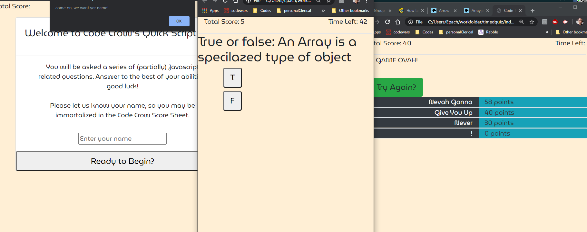

# timedquiz

 # A timed quiz made with HML, CSS, and Javascript that scores would be takers and posts a high-score rank.

1. When a user opens the page, they will be prompted to enter a name to proceed to the quiz.
2. When a user enters a name (and only when) they may click the start button, whereupon:
3. A timer will begin.
4. A question along with potential answers will appear on the screen.
5. When the user gets a correct answer, they will be awarded 5 points.
6. When the user gets an answer incorrect, they will be penalized 5 seconds.
7. When the timer reaches zero or when the user has completed all questions, the game is over, whereupon:
6. If the user gained a certain number of points, their remaining time will be added to their score.
8. The score of the user will be recorded sorted by score value, then stored in a leaderboard, which will then be generated.

9. If the user wishes to play again, they will be offered a "try again" button at the endgame screen.

